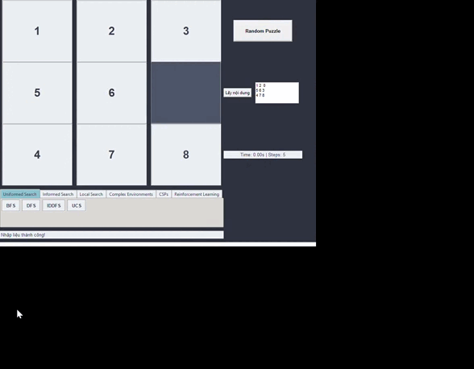
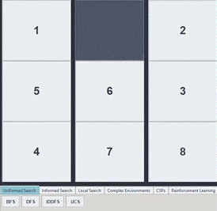
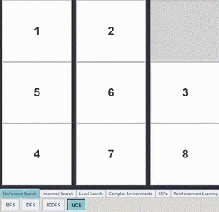
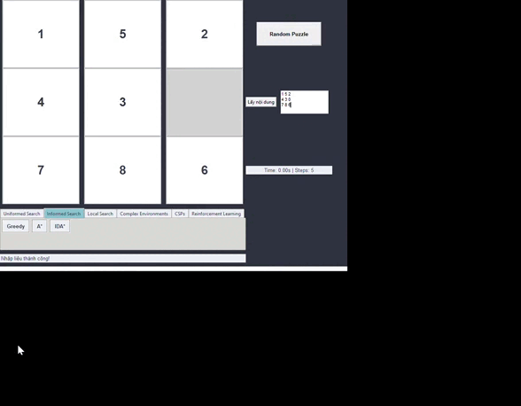
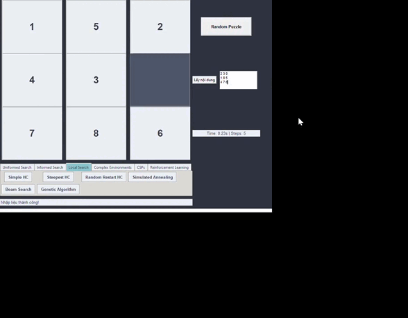
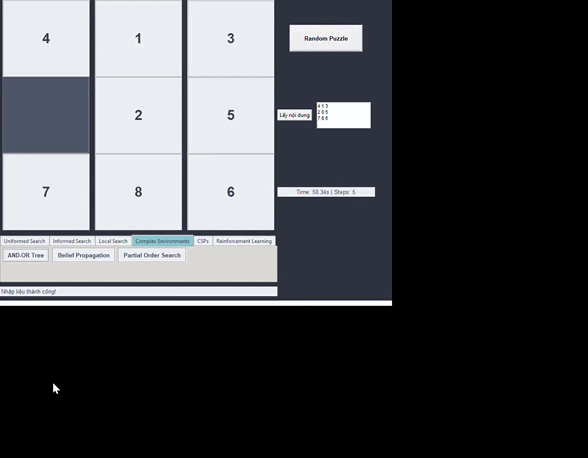
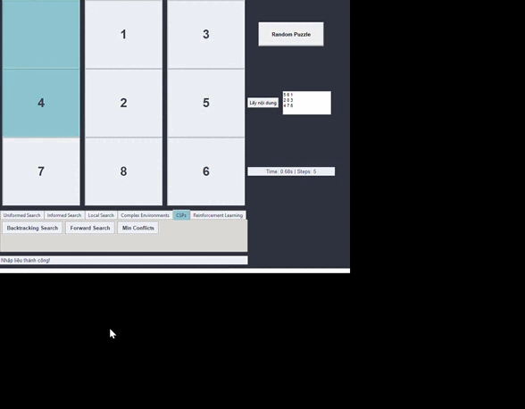
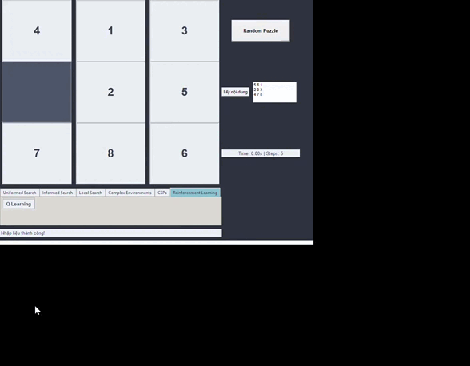

# Giải pháp cho bài toán 8-Puzzle

Dự án này là một ứng dụng Python dùng để giải bài toán 8-Puzzle (trò chơi xếp hình 3x3) với nhiều chiến lược tìm kiếm khác nhau. Giao diện người dùng được xây dựng bằng Pygame, và hiệu suất thuật toán được trực quan hóa với Plotly. Hệ thống hỗ trợ hơn 20 thuật toán tìm kiếm và cho phép đánh giá, so sánh hiệu quả của từng thuật toán.

## 🎯 Mục tiêu của dự án

Mục đích chính của dự án là phát triển một công cụ có khả năng giải bài toán 8-Puzzle linh hoạt và mở rộng. Thay vì chỉ đơn giản tìm lời giải, hệ thống hướng tới việc tạo ra một nền tảng hỗ trợ học tập, nghiên cứu AI – đặc biệt trong lĩnh vực tìm kiếm và tối ưu. Dự án phù hợp cho sinh viên, giảng viên và những ai muốn thử nghiệm, phân tích các phương pháp tiếp cận trong AI.

---

## 🧠 Các nhóm thuật toán được triển khai

### 1. Tìm kiếm không thông tin (Uninformed Search)

Bao gồm: **BFS, DFS, UCS, IDS**

- Không dùng hàm đánh giá.
- Ưu và nhược điểm được đánh giá qua số bước thực hiện, bộ nhớ và thời gian.

**Minh họa:**

---

### 2. Tìm kiếm có thông tin (Informed Search)

Bao gồm: **Greedy BFS, A*, IDA\***

- Sử dụng hàm heuristic để dẫn hướng tìm kiếm.
- Được đánh giá dựa trên số trạng thái duyệt và thời gian hoàn thành.

**Minh họa:**

---

### 3. Tối ưu cục bộ (Local Search)

Gồm: **Hill Climbing, Simulated Annealing, Beam Search, Genetic Algorithm**

- Phù hợp khi cần giải pháp nhanh, ít tài nguyên.
- Có khả năng thoát cực trị cục bộ tốt hơn các thuật toán truyền thống.

**Minh họa:**

---

### 4. Tìm kiếm trong môi trường không chắc chắn

Gồm: **AND-OR, Belief State, Partial Observable**

- Mô phỏng các điều kiện không quan sát được hoặc quan sát không đầy đủ.
- Sử dụng các tập belief state để tìm giải pháp.

**Minh họa:**

---

### 5. Tìm kiếm ràng buộc (Constraint Satisfaction)

Gồm: **Backtracking, Forward Checking, Min-Conflicts**

- Tìm cách gán giá trị vào ô trống thỏa mãn các ràng buộc định sẵn.

**Minh họa:**

---

### 6. Học tăng cường (Reinforcement Learning)

Gồm: **Q-Learning**

- Agent học cách giải bài toán thông qua việc tương tác với môi trường và tối ưu tổng phần thưởng.

**Minh họa:**

---

## 👤 Thông tin người phát triển

**Sinh viên:** Lê Thanh Tân mssv:23110316

Đây là một đồ án cá nhân được xây dựng nhằm thực hành, nghiên cứu các kỹ thuật AI hiện đại. Dự án đồng thời có thể làm tài liệu tham khảo cho sinh viên và giảng viên đang giảng dạy hoặc học các môn học liên quan đến trí tuệ nhân tạo.

---

## 📚 Tài liệu tham khảo

1. Russell, S. & Norvig, P. *Artificial Intelligence: A Modern Approach*, 3rd/4th edition.
2. Tài liệu giảng dạy AI từ Stanford, CS229 (2020).
3. Một số công cụ hỗ trợ AI như ChatGPT, Grok, v.v.
